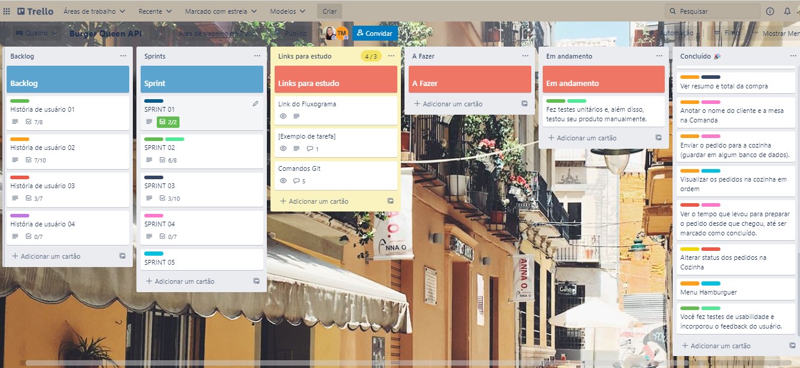
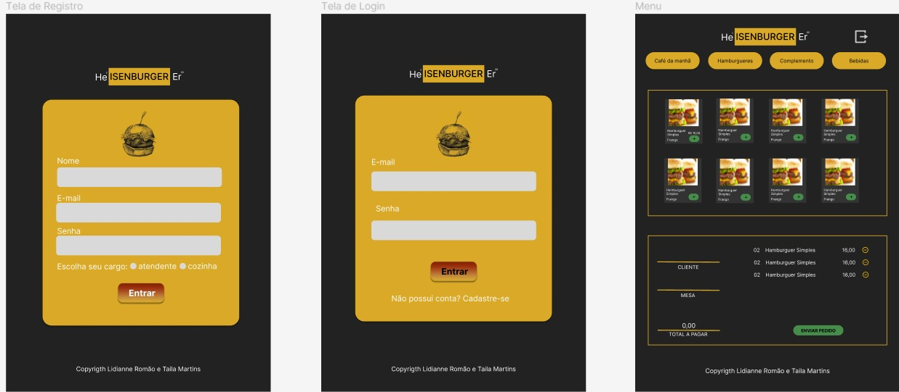

# Heisenburger

## Índice

- [1. Sobre o projeto](#1-sobre-o-projeto)
- [2. Acesso](#2-acesso)
- [3. Planejamento](#3-planejamento)
- [4. Protótipos](#4-prototipos)
- [5. Histórias de Usuário](#5-historias-de-usuario)
- [6. Features](#6-features)
- [7. Tecnologias Utilizadas](#7-tecnologias-utilizadas)
- [8. Pessoas Desenvolvedoras](#8-pessoas-desenvolvedoras)

---

## 1. Sobre o projeto

Uma rede de fast-food que está crescendo, necessita de uma interface em que se possa realizar pedidos utilizando um _tablet_, e enviá-los para a cozinha para que sejam preparados de forma ordenada e eficiente.

Este projeto tem duas áreas: interface (cliente) e API (servidor). Nosso cliente nos pediu para desenvolver uma interface que se integre com a API.

Estas são as informações que temos do cliente:

> Somos **Heisenburger**, um fast food 24hrs.
>
> A nossa proposta de serviço 24 horas foi muito bem recebida e, para continuar a
> crescer, precisamos de um sistema que nos ajude a receber pedidos de nossos
> clientes.
>
> Nós temos 2 menus. Um muito simples para o café da manhã:
>
> | Ítem                           | Preço R$ |
> | ------------------------------ | -------- |
> | Café americano                 | 5        |
> | Café com leite                 | 7        |
> | Sanduíche de presunto e queijo | 10       |
> | Suco de fruta natural          | 7        |
>
> E outro menu para o resto do dia:
>
> | Ítem                     | Preço  |
> | ------------------------ | ------ |
> | **Hambúrgueres**         | **R$** |
> | Hambúrguer simples       | 10     |
> | Hambúrguer duplo         | 15     |
> | **Acompanhamentos**      | **R$** |
> | Batata frita             | 5      |
> | Anéis de cebola          | 5      |
> | **Bebidas**              | **R$** |
> | Água 500ml               | 5      |
> | Água 750ml               | 7      |
> | Bebida gaseificada 500ml | 7      |
> | Bebida gaseificada 750ml | 10     |

## 2. Acesso

Link do Deploy: [Heisenburger](https://burgerqueenapiclient.netlify.app/)

Para acessar, você pode utilizar o usuário e senha abaixo:

> | Usuário            | Senha  |
> | ------------------ | ------ |
> | menu@burger.com    | 123456 |
> | cozinha@burger.com | 123456 |

## 3. Planejamento

Utilizamos a ferramenta Trello para fazer o planejamento da aplicação e o método Kanban para definir o processo de separação das atividades. Em dois quadros com colunas de separação, fixamos as histórias de usuário e as Sprints em que desenvolveríamos cada uma delas. Em cada item em um cartão, inserimos as atividades a serem realizadas de cada história e quebramos em pequenas tarefas. À medida que iniciávamos e concluíamos cada tarefa, movíamos os cartões para as colunas: Em andamento e concluído.

Mais detalhes no link abaixo.

[Planejamento](https://trello.com/b/TUgZ70Kb/burger-queen-api)

## 4. Protótipos

Para criação dos protótipos, utilizamos a ferramenta Figma e o Frame para Tablet.
Mais detalhes no link abaixo.

[Protótipos](https://www.figma.com/file/anLKFaqKkCVlXjycxJWzYH/Burger?node-id=0%3A1)

## 5. Histórias de Usuário

#### [História de usuário 1] Garçom/Garçonete deve poder entrar no sistema

Eu, como garçom/garçonete quero entrar no sistema de pedidos.

##### Critérios de aceitação

O que deve acontecer para satisfazer as necessidades do usuário?

- Acessar uma tela de login.
- Inserir email e senha.
- Receber mensagens de erros compreensíveis, conforme o erro e as informações inseridas.
- Entrar no sistema de pedidos caso as credenciais forem corretas.

##### Definição de pronto

O acordado abaixo deve acontecer para dizer que a história está terminada:

- Você deve ter recebido _code review_ de pelo menos uma parceira.
- Fez _testes_ unitários e, além disso, testou seu produto manualmente.
- Você fez _testes_ de usabilidade e incorporou o _feedback_ do usuário.
- Você deu deploy de seu aplicativo e marcou sua versão (tag git).

---

#### [História de usuário 2] Garçom/Garçonete deve ser capaz de anotar o pedido do cliente

Eu como garçom/garçonete quero poder anotar o pedido de um cliente para não
depender da minha memória, saber quanto cobrar e poder enviar os pedidos para a
cozinha para serem preparados em ordem.

##### Critérios de aceitação

O que deve acontecer para satisfazer as necessidades do usuário?

- Anotar o nome do cliente.
- Adicionar produtos aos pedidos.
- Excluir produtos.
- Ver resumo e o total da compra.
- Enviar o pedido para a cozinha (guardar em algum banco de dados).
- Funcionar bem em um _tablet_.

##### Definição de pronto

O acordado abaixo deve acontecer para dizer que a história está terminada:

- Você deve ter recebido _code review_ de pelo menos uma parceira.
- Fez _testes_ unitários e, além disso, testou seu produto manualmente.
- Você fez _testes_ de usabilidade e incorporou o _feedback_ do usuário.
- Você deu deploy de seu aplicativo e marcou sua versão (tag git).

---

#### [História de usuário 3] Chefe de cozinha deve ver os pedidos

Eu como chefe de cozinha quero ver os pedidos dos clientes em ordem, poder
marcar que estão prontos e poder notificar os garçons/garçonetes que o pedido
está pronto para ser entregue ao cliente.

##### Critérios de aceitação

- Ver os pedidos ordenados à medida em que são feitos.
- Marcar os pedidos que foram preparados e estão prontos para serem servidos.
- Ver o tempo que levou para preparar o pedido desde que chegou, até ser marcado
  como concluído.

##### Definição de pronto

- Você deve ter recebido _code review_ de pelo menos uma parceira.
- Fez _testes_ unitários e, além disso, testou seu produto manualmente.
- Você fez _testes_ de usabilidade e incorporou o _feedback_ do usuário.
- Você deu deploy de seu aplicativo e marcou sua versão (tag git).

---

#### [História de usuário 4] Garçom/Garçonete deve ver os pedidos prontos para servir

Eu como garçom/garçonete quero ver os pedidos que estão prontos para entregá-los
rapidamente aos clientes.

##### Critérios de aceitação

- Ver a lista de pedidos prontos para servir.
- Marcar os pedidos que foram entregues.

##### Definição de pronto

- Ter recebido _code review_ de pelo menos uma parceira.
- Fez _testes_ unitários e, além disso, testou seu produto manualmente.
- Você fez _testes_ de usabilidade e incorporou o _feedback_ do usuário.
- Você deu deploy de seu aplicativo e marcou sua versão (tag git).
- Os dados devem ser mantidos intactos, mesmo depois que um pedido for
  finalizado. Tudo isso para poder ter estatísticas no futuro.

---

## 6. Features

- [x] **Criar usuário com nome, e-mail e senha**
- [x] **Fazer login com e-mail e senha**
- [x] **Criar pedidos**
- [x] **Editar pedidos**
- [x] **Enviar pedidos para a cozinha**
- [x] **Receber pedidos na cozinha**
- [x] **Marcar pedidos como concluídos**
- [x] **Receber pedidos concluídos no menu e marcar como servidos**

## 7. Tecnologias utilizadas

- **HTML**
- **CSS**
- **Javascript**
- **React**

## 8. Pessoas desenvolvedoras

Este projeto foi desenvolvido durante o Bootcamp da Laboratória, Turma 007 pelas colaboradoras:

<table>
  <tr>
    <td align="center">
      <a href="https://www.linkedin.com/in/lromao/">
           
  
          <b>Lidianne Romão</b>
        
      </a>
    </td>
    <td align="center">
      <a href="https://www.linkedin.com/in/taila-martins/">
   
             
          <b>Taila Martins</b>
        
      </a>
    </td>
  </tr>
</table>
